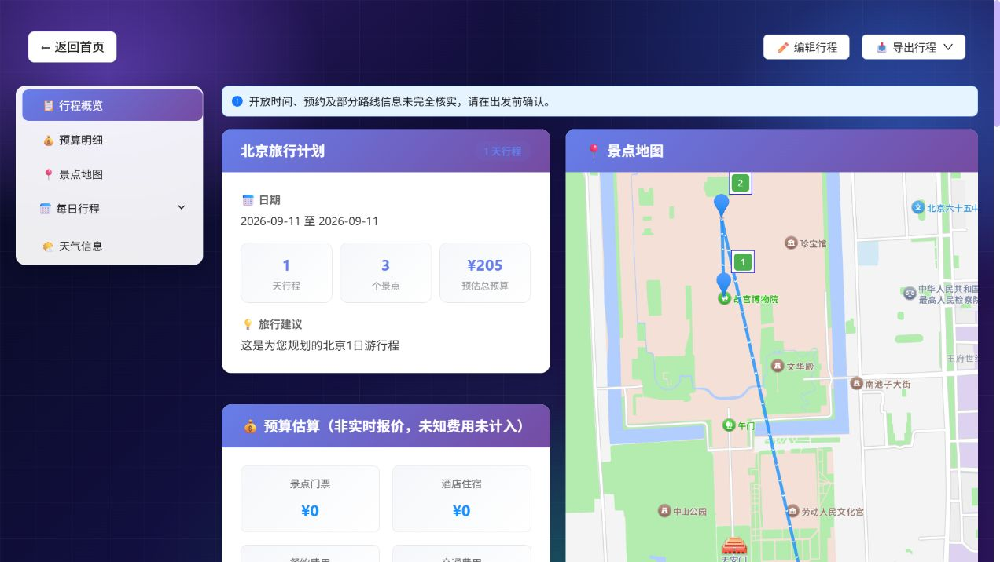

# 2026-09-10 本地验收记录

本记录在提交前采集，改动以 fd37c3f 为基线，随后纳入提交 6e70520。定位为可靠单机演示服务，不代表线上 SLA。

| 检查 | 结果与范围 |
|---|---|
| Windows 隔离 pytest | 125 项通过 |
| Docker / PostgreSQL 17 隔离 pytest | 最终镜像 125 项通过，13.49 秒；测试固定使用独立 trip_tests 库，重复运行前清空测试表 |
| 前端 | vue-tsc + Vite 通过；路由拆包后入口 JS 约 1.52 MB，Result 约 622 KB，仍有体积警告 |
| Docker 构建 | Python 3.11 slim 基础镜像安装锁定依赖并 pip check 通过；前端严格 npm ci 构建通过。网络下载中断经重试解决，未绕过完整性校验 |
| Nginx | health 通过；匿名/普通用户重建拒绝；公网 metrics 404；100 B、2 MiB、20 MiB 合成上传通过，20 MiB + 1 B 返回 413 |
| 浏览器 | 2 项通过：登录、刷新恢复结果、质量提示持久化、409 保存失败提示刷新后保留、跨用户任务/订阅隔离 |
| 20 场景完整 HTTP 链路 | 20/20 预期状态通过；16 次生成成功，全部保存；其中规则通过 15/16，降级 3/16。fixture 平均 0.276 秒，不能解释为真实模型时延 |
| 实际容器重启 | SSE 断线后仍 running；重启后 PROCESS_INTERRUPTED；重复键不重新生成，未新增历史 |
| 隔离恢复 | 七张表内容摘要一致，损坏备份被拒绝；恢复 34 条历史、2 份已发布资料的派生索引；16.454 秒，仅本轮演练规模 |
| 监控 | promtool 验证 Prometheus 配置及 3 条告警规则通过；尚未接入外部通知渠道 |
| 生产 Compose | 非秘密测试变量下 config 校验通过；未作为真实云生产服务部署 |
| 原 Docker 服务 | 保留原 PostgreSQL 连接和 /app/data 挂载，迁移到 f1a2b3c4d5e6，前后端健康；本机入口 http://localhost:8080 |

原数据备份位于 `E:/project/trip-planner-backups/pre-reliability-20260910`，包含 PostgreSQL dump、应用目录压缩包和校验清单。原后端镜像保留为 `langchain-trip-planner-backend:rollback-20260910`。旧前端镜像本地层缺失，无法完成镜像快照；回退前端需从旧版本源码重建，不承诺完整镜像一键回滚。

未运行真实付费生成效果评测，未做真实并发压测，未验证云端 CI 运行结果。原服务启动时沿用现有配置执行了嵌入维度探测，不能据此宣称零外部调用或零费用。规则评测和恢复均使用隔离数据及确定性替身。

报告：[业务](business-offline.json)、[恢复](recovery-offline.json)、[重启](lifecycle-offline.json)。运行命令及限制见 [运行手册](../reliability.md)。

## 随后追加：用户授权真实功能测试后提交

真实部署通过 18 项 HTTP 检查。北京一日行程调用模型 1 次，输入 1231 / 输出 1469 token，包含功能检查的整轮耗时 23.51 秒；生成与保存成功，无单日兜底。原报告中的“未运行付费生成”描述仅适用于前面的隔离验收阶段。

浏览器实测通过登录、偏好回填、历史打开、地图显示、编辑保存及刷新保持；版本从 2 更新至 3，首个景点游览时长从 240 改为 230 分钟。PDF 导出出现成功提示，未对下载文件逐页做视觉审计。随后发现质量提示作为 flex 分栏项导致正文被挤压，已移动到主内容区顶部；1280 宽视口下文档宽 1272，无横向溢出。补充布局断言后的 E2E 2 项通过。

实际路线存在边界：生成行程的一段公交路线无可用结果，页面展示信息缺口；额外步行路线验证返回 4918 米、3934 秒。行程仍可能同时选择父景点与内部景点，规则得分不是人工行程质量。

详细结果见 [真实功能报告](live-functional-20260910.json)，修复后截图如下。测试仅使用新建普通账号及合成需求，未编辑已有用户的数据。

